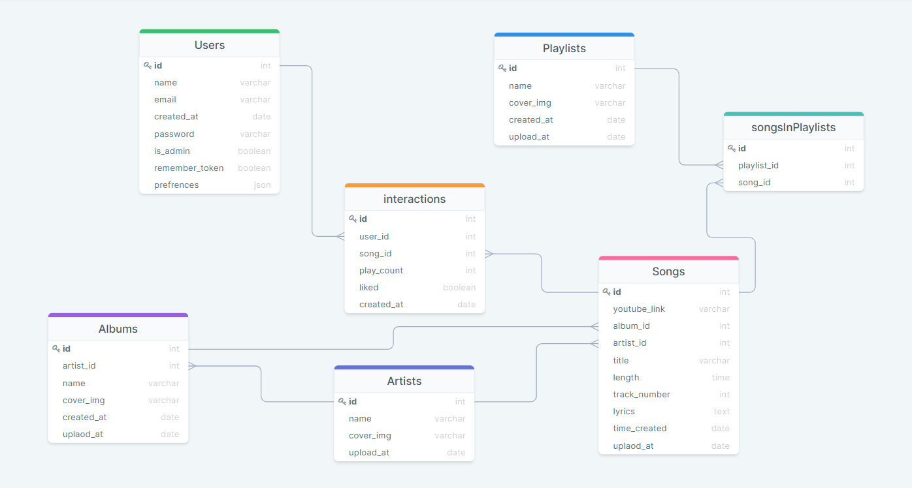

# Spotify Clone

This is my Spotify clone. 
The app mimics a spotify application, using React (and React Router), Node.js, and mySQL, with user authentication.

## How To Run
cd to client directory and run npm install, and then npm start to run the client:
```
cd client
npm install
npm start
```
cd back and cd into server directory and run npm install, and then npm run dev to start the server.
```
cd ..
cd server
npm install
npm run dev
```
**Important**: You will need to run a mysql database locally to have actual data and for the app to fully work.

Data Base Structure: 



Client app GIF: 


